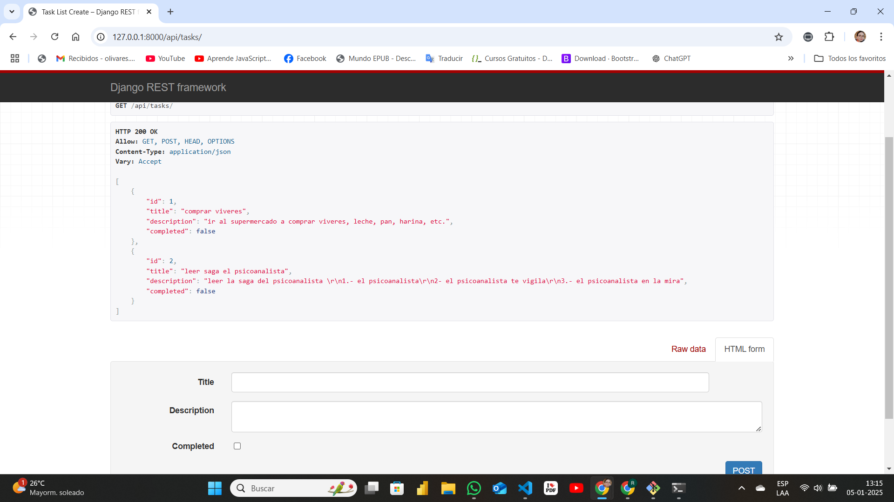

# Api Restful con Django REST Framework
Una API RESTful básica para la gestión de tareas, desarrollada con Django y Django REST Framework.
Creado de forma autodidacta.

## Requisitos previos
-Python 3.11+
-Django 5.1.4
-Django REST Framework
-Un entorno virtual (opcional, pero recomendado)

## Instalación
1. Clona este repositorio:
   ```bash
   git clone https://github.com/carola1987/ApiRestful.git

2. Navega al directorio del proyecto:
   cd api-restful

3. Crea un entorno virtual y actívalo:
   python -m venv venv
   source venv\Scripts\activate

4. Instala las dependencias:
   pip install -r requirements.txt

5. Realiza las migraciones:
   python manage.py makemigrations
   python manage.py migrate

6. Inicia el servidor:
   python manage.py runserver

## Endpoints de la API
- **GET /api/tasks/**: Lista todas las tareas.
- **POST /api/tasks/**: Crea una nueva tarea.
- **GET /api/task/<int:pk>/**: Trae una area específica.
- **PUT /api/task/<int:pk>/**: Actualiza una tarea.
- **DELETE /api/task/<int:>/**: Elimina una tarea.

## Capturas de pantalla
### Página principal


### Endpoint GET


### Endpoint POST



### Endpint PUT


### Endpoint DELETE


### Admin-Django


## Licencia
Este proyecto está bajo la Licencia MIT. Consulta el archivo [LICENSE](LICENSE) para más detalles.

## Contribuciones
Las contribuciones son bienvenidas. Por favor, abre un issue o envía un pull request.


   
